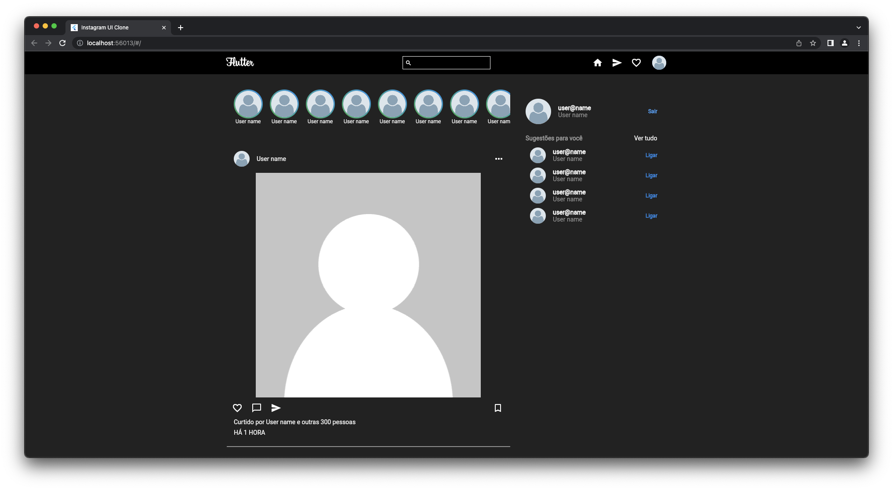
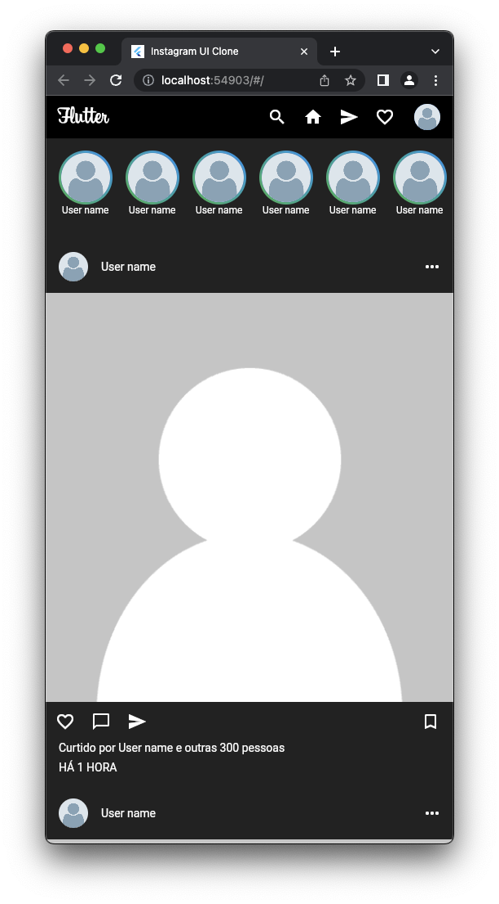

<!-- description section-->

# Instagram UI Clone

 A clone of Instagram feed page. The goal of this project is to test Flutter WEB features. So here I'm practicing web app development and application responsiveness with this tech.

    
    

<!--Page link section-->

## Live test

 You can check this clone interactively <a href="#">here.</a>

